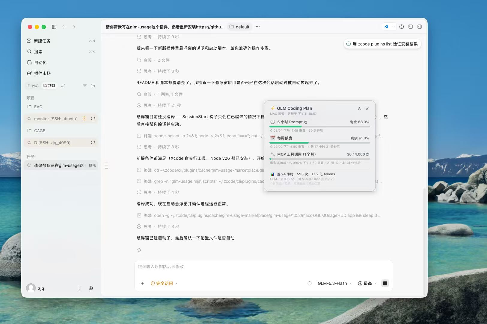
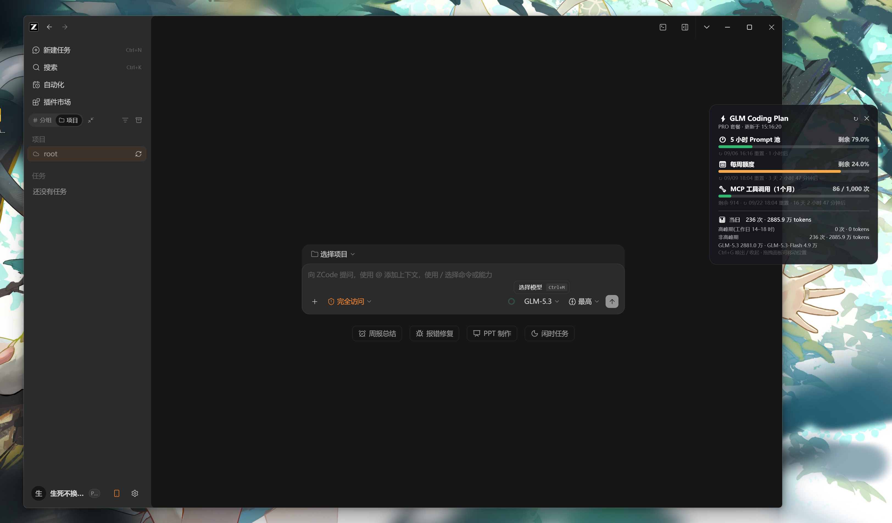
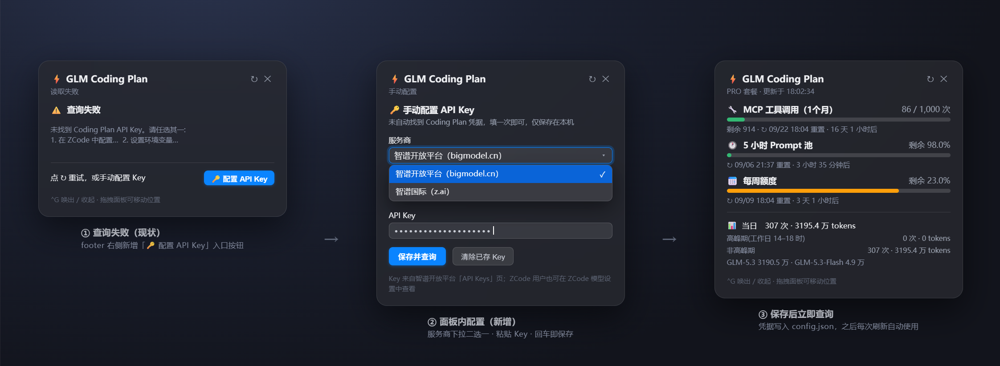

# ZCode Usage — 0.0.5

支持API KEY与账号登录两种方式查询 GLM Coding Plan 额度(当日高峰/非高峰拆分),悬浮窗展示:

| 显示项 | 内容 |
|---|---|
| ⏱ 5 小时 Prompt 池 | 已用百分比、重置倒计时 |
| 📅 每周额度 | 已用百分比、重置时间 |
| 🔧 MCP 工具调用(每月) | 已用/总量、各工具明细 |
| 📊 当日用量 | 调用次数、token 消耗、高峰期(工作日 14–18 时)/非高峰期拆分、按模型汇总 |
| ⚡ 高峰期提醒 | 工作日 14:00–18:00 橙色横幅常驻:剩余时长倒计时 + 时段进度条,结束自动收起 |

## 效果预览

桌面悬浮窗(Mac和Windows 版截图),深浅两套配色自动跟随 ZCode 外观设置切换:

| 深色 | 浅色 |
|:---:|:---:|
|  |  |

进度条颜色随用量变化:绿色(充足)→ 橙色(≥60%)→ 红色(≥85%)。对话内 `/zcode-usage:usage` 命令和终端卡片输出同样的数据。

## 前提条件

- [ZCode](https://zcode.z.ai) 桌面版
- 已在 ZCode 中配置智谱 Coding Plan 的 **API Key**或**账号**登录(设置 → 模型,插件自动读取,无需手动填;没配也不影响安装,见下方[兜底配置](#查询失败-api-key-手动配置兜底))
- Node.js ≥ 18(终端输入 `node -v` 检查)

## 安装

### 方式 A · 从 GitHub 安装(推荐)

1. ZCode 左侧栏 → **插件市场** → **发现** 页
2. 点右上角 **+** 添加插件市场,选择 **GitHub 仓库**,填入本仓库地址
3. 在市场列表中找到 **ZCode Usage**,点 **获取/安装**

> 国内网络克隆失败时,先设置环境变量 `ZCODE_HTTP_PROXY=http://host:port` 再重试(ZCode 只认这个变量,不吃普通的 http_proxy)。

### 方式 B · 本地安装

1. 下载本仓库(绿色按钮 Code → Download ZIP)并解压
2. ZCode → 插件市场 → 发现 → **+** → **本地目录**,选中解压后的**仓库根目录**(即包含 `marketplace.json` 的那一层)
3. 安装 **ZCode Usage**

### 方式 C · 只用脚本,不装插件

下载 [zcode-usage.mjs](plugins/zcode-usage/skills/zcode-usage/scripts/zcode-usage.mjs)(悬浮窗需连同 [zcode-usage-widget.ps1](plugins/zcode-usage/skills/zcode-usage/scripts/zcode-usage-widget.ps1) 一起下载,建议直接下载整个 zip),运行:

```bash
node zcode-usage.mjs --install
```

一条命令装完全部:查询脚本、`/usage` 命令、桌面悬浮窗(**装完立即弹出**)、登录自启。卸载同样一条命令:`node zcode-usage.mjs --uninstall`。

## 使用

### 1. ZCode 对话内

安装插件后**新开一个对话**(命令在会话启动时加载):

- 输入 `/zcode-usage:usage`
- 或直接问:"查一下 Coding Plan 用量""5 小时池还剩多少""周额度什么时候重置"

助手会运行脚本并把结果整理成表格。

### 2. 终端直接运行

```bash
node ~/.zcode/scripts/zcode-usage.mjs            # 卡片式输出
node ~/.zcode/scripts/zcode-usage.mjs --json     # 原始 JSON
```

插件安装者也可以直接用插件缓存里的脚本(免 --install):

```bash
node "$(ls -d "$HOME/.zcode/cli/plugins/cache"/*/zcode-usage/*/skills/zcode-usage/scripts/zcode-usage.mjs | sort -V | tail -1)"
```

### 3. 桌面悬浮窗(按设备自动选择 UI,随插件启停)

插件自带 **两套悬浮窗 UI**,SessionStart hook 会按当前设备自动选择,无需任何手动配置;**卸载插件后悬浮窗自动退出**,不残留开机自启或后台进程。

| 设备 | UI | 说明 |
|---|---|---|
| **Windows** | WPF 磨砂玻璃卡片(配色与 ZCode 外观同步) | Ctrl+G 显示/隐藏;启动 ZCode / 新建会话自动唤回;ZCode 完全退出时随之退出;✕ 隐藏、右键退出 |
| **macOS** | 原生 HUD 面板(社区移植的 ZCodeUsageHUD) | 编译一次即可:进入插件目录 `macos/` 执行 `bash build.sh`,生成 `ZCodeUsageHUD.app`;之后每次会话自动在后台打开 |
| 其他系统 | (无悬浮窗,仅命令/技能/注入) | — |

两套 UI 数据口径一致(同一个查询脚本),视觉各自贴合系统原生质感。

- Windows 版:右上角 **✕** 只是隐藏(进程驻留),**右键菜单 → 退出**彻底关闭;重复启动自动去重;位置记忆
- Windows 悬浮窗配色**与 ZCode 外观主题保持一致**(每 2 秒探测 ZCode 主窗口实际配色,深浅同步切换),不读写任何 Windows 主题设置;`GLM_WIDGET_THEME=light|dark` 可强制指定
- macOS 版:菜单栏有 ⚡ 兜底图标;详见 `macos/README.md`
- API Key 失效时面板明确提示,修复后自动恢复

**悬浮窗什么时候会出现?** 自动弹出只挂在有可靠信号的时机,其余交给手动:

| 场景 | 行为 |
|---|---|
| 冷启动(会话开始时没有实例) | 自动拉起并显示 |
| 新建会话(实例已在运行) | 自动唤回显示 |
| 切换会话 | 不动作——窗口常驻最上层,本来就在屏幕上 |
| 手动收起(✕ / Ctrl+G) | 保持收起,Ctrl+G 随时唤回;下一个新会话自动弹回 |
| ZCode 完全退出 / 插件卸载 | 悬浮窗随之退出 |

实现上:新会话唤回由 hook touch 唤醒文件(`~/.zcode/scripts/zcode-usage-widget.wake`,运行中的实例 250ms 内响应)完成;手动再次运行脚本则走命名事件唤回已有窗口。单实例互斥量、命名事件与唤醒文件都在耗时初始化(Add-Type/XAML)之前就绪,不会因主实例还在启动而丢信号。

> 不装插件只想要 Windows 悬浮窗?用下方"方式 C"的 `--install` 独立安装(带 Windows 登录自启),用 `--uninstall` 一键完整卸载。

### 4. 新会话自动注入

插件自带的 SessionStart hook 会在每个新对话开头注入一行额度摘要,无需任何配置。卸载插件即停止注入。

## 查询失败?API Key 手动配置兜底

自动探测不到凭据、悬浮窗显示「⚠️ 查询失败」时(常见于:只在开放平台单独办了套餐、用的是启动版/自定义 provider、或 ZCode 配置被移动),**不用翻配置文件**——Windows 和 macOS 悬浮窗都内置了一键兜底。点失败页右下角的 **🔑 配置 API Key** 按钮(macOS 也可从菜单栏 ⚡ 图标进入,Windows 也可从右键菜单进入),面板内直接选服务商、粘贴 Key,保存立即查询:



- **服务商下拉二选一**:智谱开放平台(`open.bigmodel.cn`)/ 智谱国际(`api.z.ai`)
- **只存本机**:`~/.zcode/zcode-usage-manual.json`。Windows 悬浮窗、macOS HUD、终端 CLI 三端共用这一份——悬浮窗里配一次,对话内 `/usage` 和终端 `node ~/.zcode/scripts/zcode-usage.mjs` 也能直接用
- **安全**:Key 输入框不回显;传给查询脚本走环境变量而非命令行参数,`ps` 进程列表里看不到
- **可反悔**:「清除已存 Key」删掉手动凭据,恢复自动探测 ZCode 配置

### 自动探测链路(找不到 Key 时按这个顺序排查)

脚本按以下顺序自动找 Key,靠前的优先:

1. `--key` / `--base` 运行参数
2. 环境变量 `ANTHROPIC_AUTH_TOKEN` + `ANTHROPIC_BASE_URL`(只设了 `ZAI_API_KEY` 时默认国际站域名)
3. 手动配置文件 `~/.zcode/zcode-usage-manual.json`(上面的 🔑 界面写入)
4. ZCode 配置 `~/.zcode/v2/config.json`(兼容 `~/.zcode/config.json`):扫描**全部**已启用 provider(自定义 provider 也能识别,凭据字段兼容 `options.apiKey` 与顶层 `apiKey` 两种写法),按 编程套餐 > 通用 排序;仅接受 `open.bigmodel.cn` / `api.z.ai` 两个官方域名

> **启动版套餐(Start Plan)用户**:启动版使用的 `zcode.z.ai` 域名没有用量监控接口,自动探测会**主动跳过**它——避免拿它的凭据查出莫名其妙的 404。悬浮窗显示「未找到 Key」属于预期行为,点 🔑 手动配置即可。

## 隐私与安全

- 插件**不含任何密钥**。脚本运行时从本机 ZCode 配置(`~/.zcode/v2/config.json`)读取你自己的 API Key
- 请求只发往智谱官方域名(`open.bigmodel.cn` / `api.z.ai`),不经过任何第三方服务器
- 查询走官方监控接口,不消耗 prompt 额度

## 常见问题

**Q:提示"未找到 Coding Plan API Key"?**
最省事:点悬浮窗失败页的 **🔑 配置 API Key** 手动填写(见[兜底配置](#查询失败-api-key-手动配置兜底),三端共用);或先在 ZCode 设置里配好智谱 Coding Plan 的 API Key;或设置环境变量 `ANTHROPIC_AUTH_TOKEN` + `ANTHROPIC_BASE_URL`,或运行时传 `--key <apiKey> --base <baseURL>`。

**Q:HTTP 401?**
API Key 无效或过期,去智谱开放平台重新获取。

**Q:不用 ZCode,能在 Claude Code 里用吗?**
可以。设置 `ANTHROPIC_AUTH_TOKEN=https://open.bigmodel.cn/api/anthropic` 对应的环境变量后直接跑脚本(国际站用 `https://api.z.ai/api/anthropic`)。

**Q:Windows 悬浮窗按 Ctrl+G 没反应?**
两种情况:①悬浮窗进程没在运行(它只随 ZCode 存活,ZCode 完全退出后自退;重开 ZCode 或新开一个对话即恢复);②全局热键被其他软件占用(截图/翻译工具等)——此时悬浮窗底部会显示橙色 ⚠ 提示,可关闭占用软件或在脚本顶部修改 `$hotkeyModifiers`/`$hotkeyKey` 换键。

**Q:新会话开始时悬浮窗偶尔不自动弹出?**
本版本已修复——旧版的唤醒事件创建得太晚,主实例启动头几秒内到达的信号会被静默丢弃。若升级后仍遇到,检查 `~/.zcode/scripts/` 目录是否存在且可写;悬浮窗没在运行时,新开一个对话即会重新拉起。

**Q:额度数字和网页后台对不上?**
查询接口是智谱未公开文档的监控接口,官方若调整字段,更新脚本中的映射即可(`TOKENS_LIMIT` unit=3 是 5 小时池、unit=6 是每周,`TIME_LIMIT` 是 MCP 每月)。

## 目录结构

```
zcode-usage-plugin/                       ← 市场仓库根目录
├── .zcode-plugin/marketplace.json      ← 市场清单
├── marketplace.json                    ← 根目录副本(兼容不同读取位置)
└── plugins/zcode-usage/                ← 插件本体
    ├── .zcode-plugin/plugin.json
    ├── hooks/hooks.json                ← SessionStart:按设备拉起悬浮窗 + 注入用量摘要
    ├── commands/usage.md               ← /zcode-usage:usage 命令
    ├── macos/                          ← macOS 原生悬浮窗(ZCodeUsageHUD.swift + build.sh)
    └── skills/zcode-usage/
        ├── SKILL.md
        └── scripts/
            ├── zcode-usage.mjs           ← 查询脚本(零依赖,支持 --install/--uninstall)
            ├── zcode-usage-widget.ps1    ← Windows 悬浮窗(磨砂玻璃卡片)
            ├── widget-launch.mjs       ← 跨平台启动器(按设备分发;新会话 touch 唤醒文件唤回已有实例)
            └── widget-launch.vbs       ← Windows 启动器(vbs,免黑窗)
```

## 卸载

**插件方式**(推荐,卸载即全清):

1. ZCode 设置 → 插件管理 → 已安装 → ZCode Usage → 卸载
2. 完成。悬浮窗会在数秒内检测到插件缓存被移除而自动退出,会话注入同时停止,不残留开机自启、进程或配置

**独立脚本方式**(曾运行过 `--install` 的用户):

```bash
node zcode-usage.mjs --uninstall
```

一键清除全部:悬浮窗进程、开机自启、`~/.zcode/scripts/` 下的脚本、`/usage` 命令、cli 配置中的 hook。

## 更新日志

- **0.0.5**:修复 Windows 悬浮窗「🔑 配置 API Key」按钮点击无反应。按钮未加入窗口拖拽排除名单,点击时 MouseLeftButtonDown 先触发 DragMove,系统移动循环吞掉 MouseLeftButtonUp,打开配置表单的处理器永不执行;现与 ↻/✕ 同样放行(命中文字或内边距均有效)。
- **0.0.4**:消除查询脚本双副本。`macos/scripts/zcode-usage.mjs` 不再手工维护,`build.sh` 编译时自动从 `skills` 正本同步(gitignore 防止生成物入库);独立分享出去的 macos 目录找不到正本时沿用现有副本。此前两份脚本已出现输出文案漂移(副本缺少「已用」前缀),今后由构建流程保证一致。
- **0.0.3**:新增 API Key 手动配置兜底。Windows/macOS 悬浮窗查询失败时,面板内直接选服务商(bigmodel/z.ai)+ 粘贴 Key,保存立即生效;三端(Windows 悬浮窗/macOS HUD/CLI)共用 `~/.zcode/zcode-usage-manual.json`,悬浮窗配一次终端也能查。凭据自动探测加固:扫描全部已启用 provider(不再只认固定 4 个名字,自定义 provider 可识别)、兼容 `~/.zcode/config.json` 布局与 `provider`/`providers` 键、兼容 UTF-8 BOM、主动跳过无监控接口的 `zcode.z.ai`(启动版)并给出明确引导;手动凭据以环境变量传给查询脚本,不出现在命令行参数。
- **0.0.2**:品牌更名 glm-usage → zcode-usage。
- **0.0.1**:悬浮窗唤回机制重做。单实例互斥量、命名事件与唤醒文件改为在 Add-Type/XAML 等耗时初始化之前建立;新会话通过唤醒文件毫秒级唤回,手动再次运行脚本走命名事件并带重试;hook 拉起的重复实例约 300ms 静默退出。修复新会话唤回不稳定(启动竞态丢信号)的问题。Windows 悬浮窗配色改为与 ZCode 外观主题保持一致(探测 ZCode 主窗口实际配色,深浅同步,`GLM_WIDGET_THEME` 可强制),不读写 Windows 主题设置。
- 更早版本见提交历史。

## License

MIT
